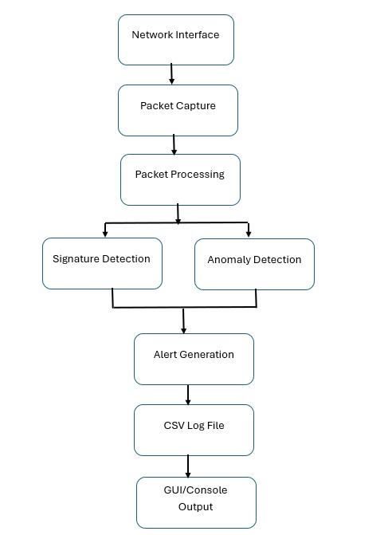
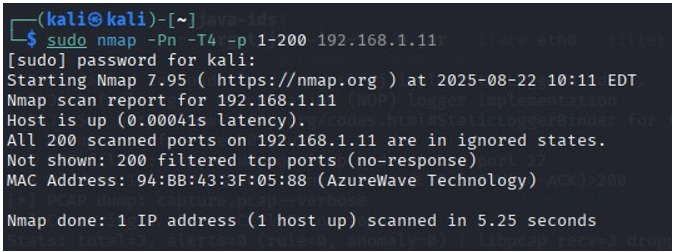
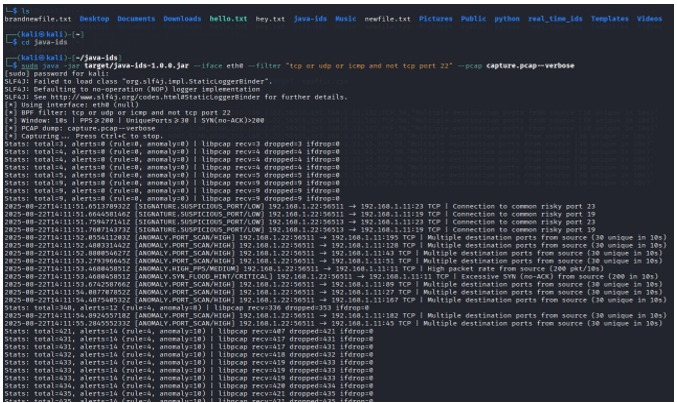
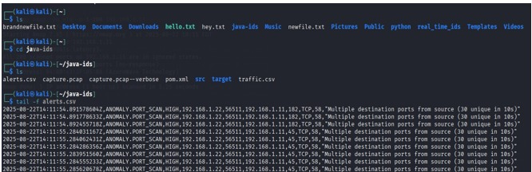
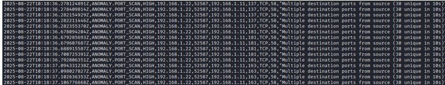
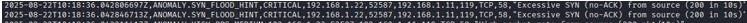
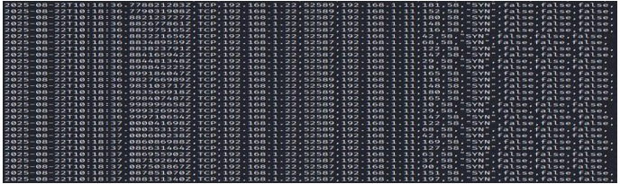
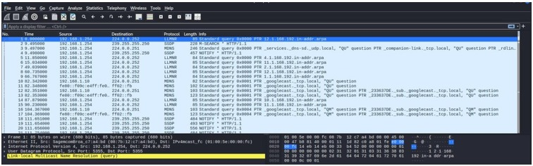

# Real-Time Network Packet Analysis & Hybrid Network Intrusion Detection System (IDS)

| **Title** | Real-Time Network Packet Analysis & Hybrid Network Intrusion Detection System (IDS) |
|------------|--------------------------------------------------------------------------------------|
| **Description** | Java-based Hybrid Intrusion Detection System (IDS) using Pcap4J for real-time packet capture, signature-based and anomaly-based threat detection. |
| **Author** | Alekhya Panguluri |

# Introduction

This project demonstrates the design and implementation of a **Hybrid Network Intrusion Detection System (IDS)** developed in Java. The application captures live network traffic, analyses packets in real time, detects malicious activities using both **signature-based** and **anomaly-based** detection techniques, and generates structured security alerts for investigation.

The project was tested using **Nmap**, **hping3**, and **Wireshark** to validate attack detection and packet analysis.

---

# Skills Used

- Java Programming
- Network Packet Analysis
- Network Security
- Intrusion Detection
- Pcap4J
- Wireshark
- Nmap
- hping3
- TCP/IP Networking
- Threat Detection
- CSV Logging
- Technical Documentation

---

# Technologies Used

- Java
- Pcap4J
- Npcap / libpcap
- Wireshark
- Nmap
- hping3
- TCP/IP Protocol Suite
- CSV Logging

---

# Project Features

- Real-time Packet Capture
- Signature-Based Detection
- Anomaly-Based Detection
- TCP NULL Scan Detection
- TCP XMAS Scan Detection
- Suspicious Port Detection
- Port Scan Detection
- SYN Flood Detection
- CSV Alert Logging
- Wireshark Validation

---

# System Architecture



---

# Project Workflow

1. Capture live network packets.
2. Extract packet information.
3. Perform signature-based analysis.
4. Perform anomaly-based analysis.
5. Generate security alerts.
6. Store alerts in CSV format.
7. Validate captured packets using Wireshark.

---

# Testing Results

## Nmap Port Scan Detection



The IDS successfully detected reconnaissance activity performed using Nmap and generated a Port Scan alert.

---

## Real-Time IDS Monitoring



The application continuously monitored live traffic while displaying generated alerts in real time.

---

## Alert Log Analysis



Security events were automatically recorded in CSV format, providing timestamps, severity levels, source and destination information, and alert descriptions.

---

## Port Scan Detection



Behavioural analysis detected abnormal scanning behaviour by monitoring repeated connections to multiple destination ports.

---

## SYN Flood Detection



The IDS successfully detected excessive SYN packets and generated a high-severity alert indicating a potential Denial-of-Service attack.

---

## Packet Capture & Wireshark Validation





Captured packets were validated using Wireshark to verify that IDS alerts accurately matched observed network traffic.

---

# Project Documentation

The complete technical report is available in the **docs** folder.

📄 **docs/IDS_Technical_Project_Report.pdf**

---

# Future Improvements

- Machine Learning-based Detection
- SIEM Integration (Wazuh / Splunk)
- Dashboard Visualisation
- Email Notifications
- IPv6 Support
- Threat Intelligence Integration
- Cloud Deployment

---

# Repository Structure

```text
Java-hybrid-network-intrusion-detection-system
│
├── README.md
├── docs
│   └── IDS_Technical_Project_Report.pdf
│
└── screenshots
    ├── architecture.png
    ├── nmap-port-scan.png
    ├── ids-console.png
    ├── alerts-csv.png
    ├── port-scan-detection.png
    ├── syn-flood-detection.png
    ├── packet-capture.png
    └── wireshark-validation.png
```
